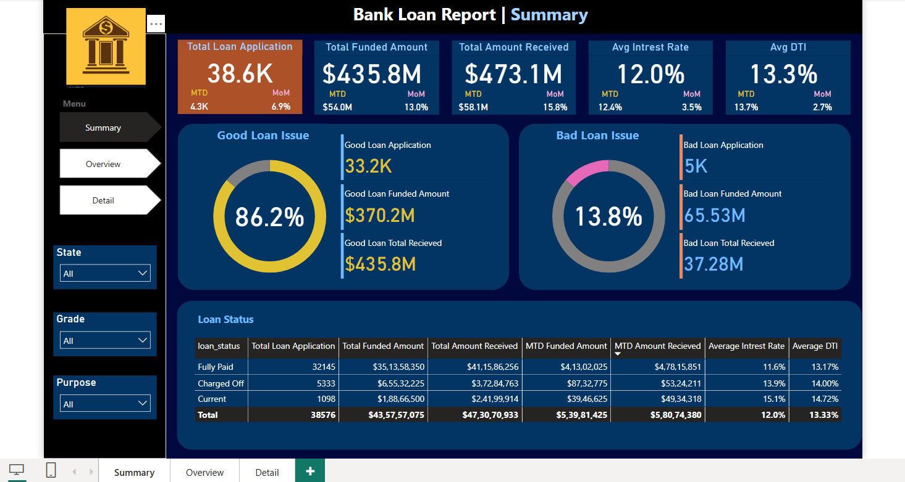
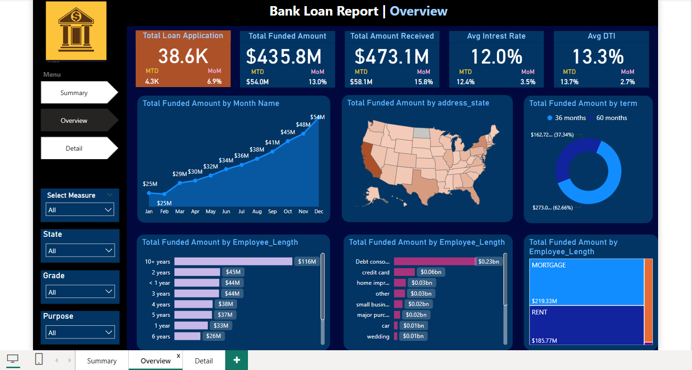
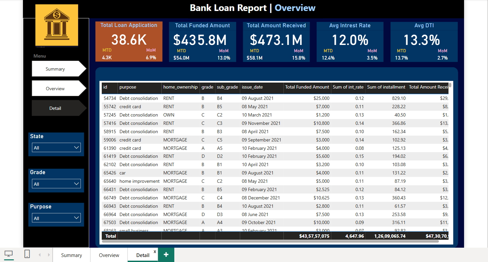

# 🏦 Bank Loan Report — Power BI

A comprehensive 3-page Power BI dashboard analyzing bank loan performance across 38,600+ applications — tracking funded amounts, repayment rates, good vs bad loans, and regional/temporal trends with MTD and MoM comparisons.

---

## 📸 Dashboard Pages

### Page 1 — Summary


### Page 2 — Overview


### Page 3 — Detail


---

## 🎯 Project Overview

This dashboard provides a full picture of a bank's loan portfolio health. It classifies loans as Good (fully paid/current) vs Bad (charged off), tracks funding and repayment trends, and allows drill-down by state, grade, purpose, and employee length — supporting both executive summaries and granular loan-level analysis.

---

## 📈 Key Metrics at a Glance

| Metric | Value | MTD | MoM |
|---|---|---|---|
| Total Loan Applications | **38.6K** | 4.3K | +6.9% |
| Total Funded Amount | **$435.8M** | $54M | +13.0% |
| Total Amount Received | **$473.1M** | $58.1M | +15.8% |
| Avg Interest Rate | **12.0%** | 12.4% | +3.5% |
| Avg DTI | **13.3%** | 13.7% | +2.7% |

---

## ✨ Dashboard Pages & Features

### 📋 Page 1 — Summary
- **Good Loan KPIs** — 86.2% good loan rate, 33.2K applications, $370.2M funded, $435.8M received
- **Bad Loan KPIs** — 13.8% bad loan rate, 5K applications, $65.53M funded, $37.28M received
- **Loan Status Table** — Fully Paid (32,145), Charged Off (5,333), Current (1,098) with full financial breakdown
- **Filters** — State, Grade, Purpose slicers

### 🌍 Page 2 — Overview
- **Monthly Trend Line** — Total Funded Amount by month ($25M Jan → $54M Dec)
- **US State Choropleth Map** — Funded amount by state (California highest)
- **Loan Term Donut** — 36 months (37.34%) vs 60 months (62.66%)
- **Employee Length Bar Chart** — 10+ years employees lead with $116M funded
- **Loan Purpose Bar Chart** — Debt consolidation dominates at $0.23bn
- **Home Ownership Treemap** — Mortgage vs Rent vs Own breakdown
- **Select Measure Slicer** — Switch between different metrics dynamically

### 📊 Page 3 — Detail
- **Drill-through Table** — Loan-level data with ID, purpose, home ownership, grade, sub-grade, issue date, funded amount, interest rate, installment, amount received
- **Filters** — State, Grade, Purpose slicers

---

## 🗂️ Data Model

| Table | Description |
|---|---|
| `Financial_loan` | Main fact table with all loan records |
| `Date Table` | Date dimension for time intelligence |
| `Table` | Calculated measures table |
| `Select Measure` | Dynamic measure selector |

---

## 🔑 Key DAX Measures

```dax
-- Total Loan Applications
Total Loan Application = COUNT(Financial_loan[id])

-- Total Funded Amount
Total Funded Amount = SUM(Financial_loan[loan_amount])

-- Total Amount Received
Total Amount Received = SUM(Financial_loan[total_payment])

-- Average Interest Rate
Average Intrest Rate = AVERAGE(Financial_loan[int_rate])

-- Average DTI
Average DTI = AVERAGE(Financial_loan[dti])

-- Good Loan Application
Good Loan Application = 
CALCULATE(COUNT(Financial_loan[id]),
    Financial_loan[loan_status] IN {"Fully Paid", "Current"})

-- Good Loan %
Good Loan % = DIVIDE([Good Loan Application], [Total Loan Application], 0) * 100

-- Bad Loan Application
Bad Loan Application = 
CALCULATE(COUNT(Financial_loan[id]),
    Financial_loan[loan_status] = "Charged Off")

-- Bad Loan %
Bad Loan % = DIVIDE([Bad Loan Application], [Total Loan Application], 0) * 100

-- MTD Loan Application
MTD Loan Application = 
CALCULATE([Total Loan Application], DATESMTD('Date Table'[Date]))

-- MOM Loan Application
MOM Loan Application = 
VAR CM = [MTD Loan Application]
VAR PM = CALCULATE([MTD Loan Application], DATEADD('Date Table'[Date], -1, MONTH))
RETURN DIVIDE(CM - PM, PM, 0)

-- MTD Total Funded Amount
MTD TOtal Funded Amount = 
CALCULATE([Total Funded Amount], DATESMTD('Date Table'[Date]))

-- MOM Funded Amount
MOM Funded Amount = 
VAR CM = [MTD TOtal Funded Amount]
VAR PM = CALCULATE([MTD TOtal Funded Amount], DATEADD('Date Table'[Date], -1, MONTH))
RETURN DIVIDE(CM - PM, PM, 0)

-- PMTD Funded Amount (Previous MTD)
PMTD Funded Amount = 
CALCULATE([Total Funded Amount], 
    DATESMTD(DATEADD('Date Table'[Date], -1, MONTH)))
```

---

## 💡 Key Insights

- ✅ **86.2% Good Loan rate** — strong portfolio health with $435.8M received vs $370.2M funded
- ⚠️ **Charged Off loans** have an average interest rate of 13.9% — higher risk borrowers cost more
- 📅 **December** is the peak month with $54M funded — showing strong year-end lending activity
- 🏠 **Mortgage holders** receive the most funding ($219.33M) vs Rent ($185.77M)
- 👔 **10+ year employees** are the most funded segment at $116M — indicating creditworthiness linked to job stability
- 💳 **Debt consolidation** is the top loan purpose at $0.23bn — reflecting consumer financial behavior
- ⏱️ **60-month term loans** dominate at 62.66% — borrowers prefer lower monthly payments

---

## 📁 Repository Structure

```
bank-loan-report-powerbi/
│
├── Bank_Loan_Report.pbix            # Main Power BI report (3 pages)
├── data/
│   └── financial_loan.csv           # Source dataset
├── assets/
│   ├── Dashboard1-Summary.png       # Summary page screenshot
│   ├── Dashboard2-Overview.png      # Overview page screenshot
│   └── Dashboard3-Detail.png        # Detail page screenshot
├── .gitignore
└── README.md
```

---

## 🚀 How to Open

1. Download [Power BI Desktop](https://powerbi.microsoft.com/desktop/) — free
2. Clone this repo:
   ```bash
   git clone https://github.com/Naaveen13/bank-loan-report-powerbi.git
   ```
3. Open `Bank_Loan_Report.pbix` in Power BI Desktop
4. If prompted, update data source path to `data/financial_loan.csv`
5. Click **Refresh** and explore all 3 pages!

---

## 📬 Contact

**Naveen Krishna Venigandla**  
📧 naveenkrishna.v13@gmail.com  
🔗 [LinkedIn](https://www.linkedin.com/in/naveen-krishna-324b341bb)
